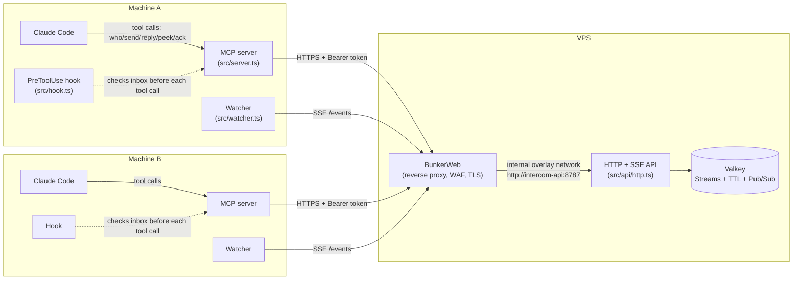
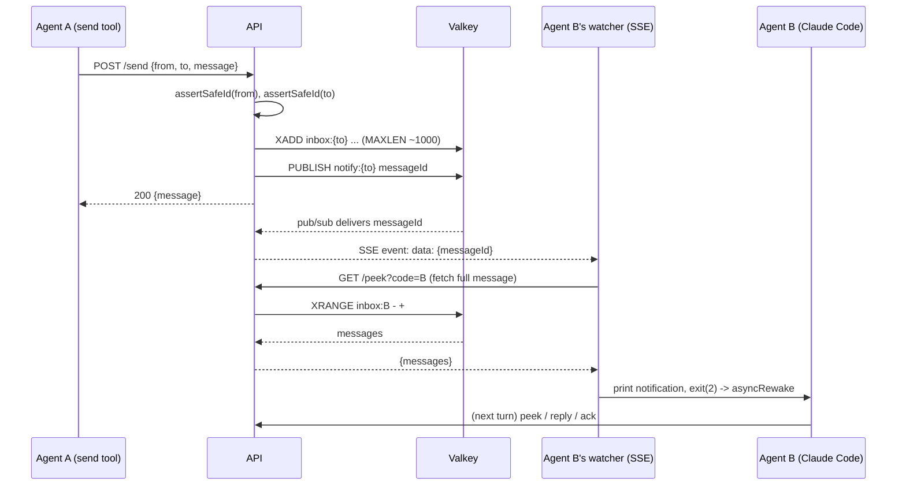
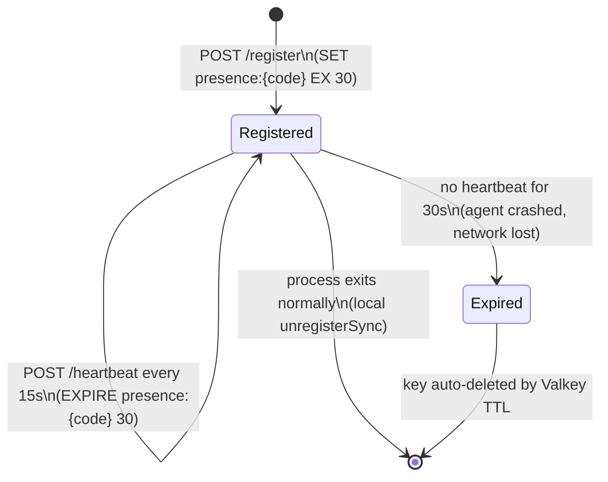
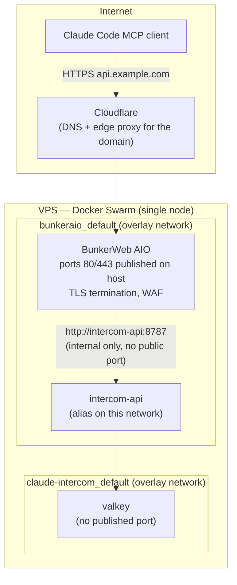

# Architecture & Flows

Technical reference for how `claude-intercom` is built, both in local-only mode and
with the hosted V1 backend. See the [README](../README.md) for setup instructions and
the [PRD](../_bmad-output/planning-artifacts/prd-intercom-saas-v1.md) /
[epics](../_bmad-output/implementation-artifacts/epics-intercom-saas-v1.md) for the
product decisions behind this.

## Components

Local-only mode (no `INTERCOM_API_URL` set) skips the VPS entirely: `src/store.ts`
reads/writes JSON files under `~/.claude/mcp-intercom/store/` and `fs.watch` replaces
the SSE connection. Both modes expose the same 6 MCP tools to Claude Code.

## Sending a message (hosted mode)

If the SSE connection drops (proxy issue, network blip), the watcher falls back to
polling `/peek` every 2s — the message is never lost since it's durably stored in the
Stream until acknowledged (`XDEL`).

## Presence lifecycle

No manual cleanup process is needed — `who` (`listAgents`) only ever sees keys that
Valkey hasn't expired yet.

## Deployment topology (VPS)

`docker-compose.yml` is the base definition (also used for local dev via
`docker-compose.override.yml`, which publishes ports on `localhost`).
`docker-compose.vps.yml` adds the `bunkeraio_default` network join and is applied only
on the VPS via `docker stack deploy -c docker-compose.yml -c docker-compose.vps.yml`.
